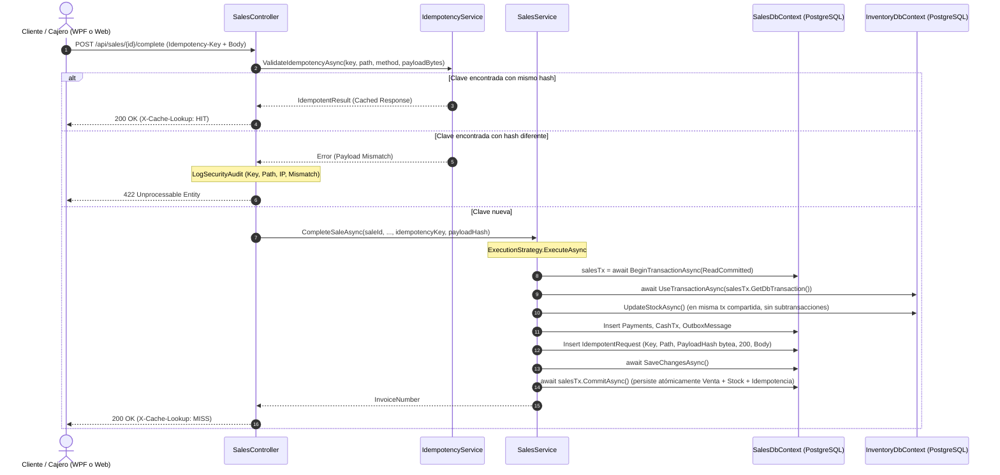

# Arquitectura del Sistema POS Administrador

Documento de referencia completa de la arquitectura, dependencias entre módulos, flujos de eventos y contextos de datos.

---

## 1. Visión General del Sistema

El sistema POS es una aplicación de punto de venta multiplataforma compuesta por:

- **Backend API** (ASP.NET Core 9) — Servidor central, REST + SignalR
- **Web Frontend** (React 19 + Vite 8) — Cliente web para cajas y tablets
- **Desktop Client** (WPF .NET 9) — Cliente de escritorio para cajas fijas
- **Updater Service** — Servicio de auto-actualización del cliente WPF
- **Installer** (Inno Setup 7) — Paquete de despliegue

### Arquitectura de Alto Nivel

```
                    ┌─────────────────────────────────────────────┐
                    │         PostgreSQL 18 (CommandCenterDb)      │
                    │  ┌─────────────────┐  ┌──────────────────┐  │
                    │  │ InventoryDbContext│  │ SalesDbContext   │  │
                    │  │ (Products, Stock │  │ (Users, Sales,   │  │
                    │  │  Movements, etc) │  │  CashDrawer, etc)│  │
                    │  └─────────────────┘  └──────────────────┘  │
                    └───────────────────┬─────────────────────────┘
                                        │ EF Core
                    ┌───────────────────┴─────────────────────────┐
                    │         Backend.API (ASP.NET Core 9)         │
                    │  ┌──────────────┐  ┌────────────────────┐  │
                    │  │   REST API   │  │  ExchangeRateHub   │  │
                    │  │  (13 Controllers)│ │  (SignalR)        │  │
                    │  └──────────────┘  └────────────────────┘  │
                    │  ┌──────────────┐  ┌────────────────────┐  │
                    │  │ MediatR Bus  │  │  Quartz Jobs       │  │
                    │  │ (SaleMade)   │  │ (BCV Rate, Stock   │  │
                    │  └──────────────┘  │  Archiver)         │  │
                    │                     └────────────────────┘  │
                    │  ┌──────────────┐  ┌────────────────────┐  │
                    │  │ JWT Auth     │  │  Middleware Pipeline│  │
                    │  │ + Password   │  │ (Exception,Version)│  │
                    │  └──────────────┘  └────────────────────┘  │
                    └───────────────────┬─────────────────────────┘
                                        │ HTTP + SignalR
              ┌─────────────────────────┼─────────────────────────┐
              │                         │                         │
              ▼                         ▼                         ▼
    ┌─────────────────┐    ┌─────────────────┐    ┌─────────────────┐
    │  Web Frontend   │    │ Desktop.Client  │    │ UpdaterService  │
    │  React 19 + Vite│    │  WPF .NET 9     │    │  (auto-update)  │
    │  11 Pages       │    │  MVVM + Resilience│   └─────────────────┘
    │  29 Components  │    │  12 ViewModels   │
    └─────────────────┘    │  8 Services      │
                           └─────────────────┘
```

---

## 2. Módulos del Backend

### 2.1 `Core` — Librería Compartida

Dependencias: **Ninguna** (es la raíz del grafo de dependencias).

| Componente | Archivos | Descripción |
|---|---|---|
| `Entities/` | BaseEntity, Customer, ExchangeRateHistory, Order, Product, StockMovement, StockReservation, SystemSetting, User | Entidades de dominio compartidas por Backend + Desktop |
| `DTOs/` | BulkImportRequestDto, CustomerDto, PagedResultDto, ProductDto, ProductImportDto, ProductQuickInfoDto, SaleDto, UserDto | DTOs inter-módulo |
| `Interfaces/` | ICurrentUserService, IInventoryService, ISystemSettingsService | Contratos compartidos |
| `Events/` | SaleMadeEvent (record) | Evento MediatR para desacoplar ventas↔inventario |
| `Configuration/` | SystemSettingsOptions | Opciones tipadas de configuración |
| `Logging/` | AppLogger, ClientStateLogger | Logger serializado a disco |
| `Helpers/` | (utilidades) | Helpers compartidos |

**Entidades principales:**
- `User` — Cédula, Username, PasswordHash, Role (Admin/Cashier/Driver), MustChangePassword
- `Product` — SKU (código de barras), precios USD/Bs.S, stock, unidad de medida, IsCashAdvance
- `Customer` — Cédula/RIF, crédito, estado
- `Sale` — InvoiceNumber, TotalUSD, TotalBsS, AppliedRate, CustomerId, CashierId
- `SaleItem` — UnitPrice (USD), UnitPriceBsS, SubtotalBsS, Quantity
- `SalePayment` — Amount (USD), AmountBsS, ExchangeRate, PaymentMethodId
- `CashDrawerSession` — OpeningBalanceLocal, ClosingBalanceLocal, UserId
- `CashTransaction` — AmountUsd, AmountLocal, IsPhysicalCash, Type (Inflow/Outflow)
- `DailyClosure` — TotalExpectedBsS, TotalActualBsS, TotalDifferenceBsS

### 2.2 `Sales.Module` — Dominio de Ventas y Caja

Dependencias: `Core`

| Componente | Archivos | Descripción |
|---|---|---|
| `Entities/` | Sale, SaleItem, SalePayment, SaleDeliveryStatus, CashDrawerSession, CashTransaction, ClosureDetail, DailyClosure, PaymentMethod | Entidades de ventas/caja |
| `Services/` | SalesService, CashDrawerService, DailyClosureService, PaymentMethodService, ClosurePdfGenerator | Servicios de negocio |
| `Interfaces/` | ICashDrawerService, IDailyClosureService, IPaymentMethodService, ISalesService | Contratos |
| `DTOs/` | PendingPickupDto, SaleHistoryDto, UpdateSaleItemsRequestDto | DTOs de ventas |
| `Data/` | SalesDbContext | DbContext de ventas |
| `Helpers/` | TimeZoneHelper | Helpers de zona horaria |
| `Migrations/` | 22 archivos | Migraciones EF Core de ventas/caja |

### 2.3 `Inventory.Module` — Dominio de Inventario

Dependencias: `Core`

| Componente | Archivos | Descripción |
|---|---|---|
| `Services/` | InventoryService, SystemSettingsService | Servicios de inventario |
| `Data/` | InventoryDbContext | DbContext de inventario |
| `EventHandlers/` | InventorySaleMadeEventHandler | Consumidor de SaleMadeEvent (MediatR) |
| `Migrations/` | 13 archivos | Migraciones EF Core de inventario |

### 2.4 `Logistics.Module` — Placeholder

Solo contiene `Logistics.Module.csproj` sin código fuente. Espacio reservado para futuras funcionalidades de logística.

### 2.5 `Backend.API` — API REST + SignalR

Dependencias: `Core`, `Sales.Module`, `Inventory.Module`, `MediatR`, `Quartz`

| Componente | Archivos | Descripción |
|---|---|---|
| `Controllers/` | AuthController, CashDrawerController, DailyClosureController, ExchangeRateController, HealthController, PaymentMethodsController, ProductsController, ReservationsController, SalesController, SettingsController, ShiftsController, UsersController, VersionCheckController | 13 controladores REST |
| `Services/` | BcvScraperService, CurrentUserService, PasswordHasher, TokenService | Servicios auxiliares |
| `Hubs/` | ExchangeRateHub | SignalR hub para tasas de cambio en tiempo real |
| `Jobs/` | StockMovementArchiverJob, BcvExchangeRateJob (Sincronización automática de tasa BCV cada 2 horas con scraping resiliente) | Tareas programadas (BackgroundService) |
| `Middleware/` | GlobalExceptionHandlerMiddleware, VersionCheckMiddleware | Middleware de excepciones y versioning |
| `DTOs/` | AdjustStockRequestDto, AdjustStockResultDto, BarcodeScanResultDto, CashDrawerOpenRequestDto, etc. | DTOs de API |

---

## 3. Clientes

### 3.1 Web Frontend (React 19 + Vite 8)

Dependencias: Backend API (HTTP + SignalR)

| Categoría | Archivos | Descripción |
|---|---|---|
| **Pages** (11) | LoginPage, PosPage, CatalogPage, HistoryPage, PendingOrdersPage, PendingPickupsPage, RegisterPage, RegisterClosePage, SettingsPage, ExchangeRatePage | Páginas principales |
| **Components** (29) | Layout, Cart, ProductGrid, ProductSearch, CustomerSelector, BarcodeScannerModal, CheckoutModal, HoldSaleModal, PartialPaymentModal, SuccessScreen, ATMInput, etc. | Componentes reutilizables |
| **Context** (3) | AuthContext, ExchangeRateContext, CartContext | Estado global React |
| **Services** (api.js) | productService, salesService, cashDrawerService, etc. | Capa de comunicación HTTP |

**Dependencias npm:**
- `@microsoft/signalr` ^10.0.5 — SignalR client
- `@zxing/library` ^0.23.0 — Barcode scanning
- `lucide-react` ^1.27.0 — Icons
- `react` ^19.2.7, `react-dom` ^19.2.7

### 3.2 Desktop Client (WPF .NET 9)

Dependencias: Backend API (HTTP + SignalR), `Desktop.Client.Core`

| Componente | Archivos | Descripción |
|---|---|---|
| `Views/` | MainWindow, PosView, InventoryView, SalesHistoryView, PendingOrdersView, PendingPickupsView, SettingsView, ExchangeRateView, CashDrawerView, DailyClosureView, UsersManagementView, CustomerManagementView, BarcodeScannerWindow, ChangePasswordDialog, CashAdvanceDialog, etc. | Vistas WPF |
| `Services/` | WpfDialogService, BarcodeScannerService, OcrService | Servicios de UI |
| `Converters/` | BoolToStatusConverter, InverseBooleanToVisibilityConverter, etc. | Value converters |
| `Controls/` | Custom controls | Controles personalizados |
| `Themes/` | NavTheme.xaml | Tema MaterialDesign |

**Patrón:** MVVM con Data Binding, Commands, INotifyPropertyChanged

### 3.3 Desktop Client Core (MVVM + Resilience)

Dependencias: `Core` (compartido), Backend API (HTTP)

| Componente | Archivos | Descripción |
|---|---|---|
| `ViewModels/` (12) | MainViewModel, LoginViewModel, PosViewModel, CartViewModel, InventoryViewModel, SalesHistoryViewModel, PendingOrdersViewModel, PendingPickupsViewModel, CashDrawerViewModel, CheckoutViewModel, SettingsViewModel, ExchangeRateViewModel, etc. | ViewModels MVVM |
| `Services/` | HealthPollingService, ResilienceHandler, UserSessionHeaderHandler, ClientStateService, UserSession, ProductionJitterProvider, ProductService, SalesService, CashDrawerService, PaymentService, ExchangeRateService, VersionCheckService, UserService | Servicios de negocio + resiliencia |
| `Messages/` | (event messages) | Mensajes para WeakReferenceMessenger |
| `Helpers/` | (utilidades) | Helpers MVVM |

**Patrón de Resiliencia:**
```
HttpClient
  └─ UserSessionHeaderHandler (agrega X-User-Id, X-User-Role, X-Client-Version)
      └─ ResilienceHandler (retry con jitter exponencial, circuit breaker)
          └─ Backend API
```

---

## 4. Flujos de Eventos

### 4.1 Evento MediatR: SaleMadeEvent

```
┌──────────────┐    Publish     ┌──────────────┐    Handle     ┌─────────────────────────────┐
│ SalesService │ ──────────────►│  MediatR Bus │ ────────────►│ InventorySaleMadeEventHandler│
│ (crea venta) │                │              │               │ (descuenta stock)            │
└──────────────┘                └──────────────┘               └─────────────────────────────┘
```

**Datos del evento:**
```csharp
public record SaleMadeEvent(
    int SaleId,
    DateTime SaleDate,
    IEnumerable<SaleItemSnapshot> Items) : INotification;

public record SaleItemSnapshot(
    int ProductId,
    decimal Quantity);
```

**Handler:** `InventorySaleMadeEventHandler` descuenta stock con retry (3 intentos) y logging de fallos críticos.

### 4.2 SignalR: ExchangeRateHub (Modelo Híbrido: Automático + Manual a Demanda)

```
┌──────────────────────┐    POST /sync-bcv    ┌──────────────┐    Broadcast    ┌──────────────────┐
│ Administrador /      │ ───────────────────► │ ExchangeRate │ ──────────────► │ Web Frontend     │
│ BcvExchangeRateJob   │    POST /api/rate    │ Hub          │                 │ (ExchangeRateCtx)│
│ (Automático cada 2h) │ ◄─────────────────── │              │                 │ Desktop Client   │
└──────────────────────┘   200 OK + Caché     └──────────────┘                 │ (ExchangeRateSvc)│
                           Purge bcv_rate_today                                └──────────────────┘
```

**Flujo y Principios de Diseño:**
1. **Modelo Híbrido Resiliente:**
   - **Automático:** `BcvExchangeRateJob` se ejecuta en segundo plano cada 2 horas (`PeriodicTimer(TimeSpan.FromHours(2))`). Consulta el portal oficial del BCV respetando el timeout configurado en `appsettings.json` (`BcvSettings:TimeoutSeconds`, default 15s).
   - **A Demanda / Manual:** El administrador puede sincronizar con el botón oficial (`POST /api/exchange-rate/sync-bcv`) o con la tecla rápida `F5` en el POS; o bien digitar manualmente la tasa de contingencia.
2. **Defensas del Scraper y Observabilidad:**
   - Si el scraper falla por conectividad o el portal del BCV retorna HTTP 502/504/timeout, el error es atrapado con log estructurado (`[BCV Scraper Audit]`), y la tasa activa se **preserva intacta** sin generar interrupción de caja.
   - Validación de Rango Razonable: Si el valor extraído es menor o igual a 0 o mayor o igual a 1,000,000, se descarta emitiendo advertencia de auditoría estructurada.
   - Redondeo Hacia Arriba (Ceiling): Se aplica redondeo hacia arriba a 2 decimales (`PricingCalculator.RoundExchangeRateCeiling`: `Math.Ceiling(rate * 100) / 100`; ej. 804.6301 -> 804.64) antes de persistir y propagar.
3. **Corte Diario y Zona Horaria Legal (Venezuela UTC-4):**
   - El sistema calcula la fecha de la jornada cambiaria mediante `Core.Helpers.TimeZoneHelper.GetVenezuelaDate()` (`America/Caracas` / `Venezuela Standard Time` / offset fijo UTC-4).
   - Esto previene que al cruzar las 8:00 PM (hora local), el sistema salte a la fecha UTC del día siguiente.
   - Si no existe cotización para el día actual (fines de semana, feriados bancarios o inicio de jornada), `GET /api/exchange-rate/today` aplica fallback al último registro histórico válido hasta hoy (`Where(r => r.Date <= today).OrderByDescending(r => r.Date)`), garantizando que el sistema jamás devuelva `0` ni caiga en contingencia de `1`.
4. **Propagación en Tiempo Real:**
   - Ante cualquier cambio, se persiste en `ExchangeRateHistory`, se purga la clave en memoria `bcv_rate_today`, se recalculan las ventas en espera (`RecalculateOnHoldSalesAsync`) y se emite `ReceiveRateUpdate` y `OnHoldSalesUpdated` vía `ExchangeRateHub`.
5. **Consideración Multi-instancia y Concurrencia:**
   - La arquitectura actual asume una **única instancia primaria** del backend (`PosBackendService`) por punto de venta/sucursal física.
   - Para futuros despliegues multi-nodo o clústeres balanceados, la ejecución concurrente de `BcvExchangeRateJob` debe coordinarse mediante un mecanismo de exclusión mutua distribuida (por ejemplo, PostgreSQL Session Advisory Locks `pg_try_advisory_lock` o un lease en base de datos) para evitar scraping redundante, y la invalidación de `IMemoryCache` debe transicionar a un bus distribuido (Redis / Npgsql Listen-Notify).

### 4.3 HealthPolling (Desktop Client)

```
┌──────────────────────┐    GET /health    ┌──────────────┐
│ HealthPollingService │ ────────────────►│ Backend API  │
│ (cada 3 segundos)    │ ◄────────────────│              │
│                      │    200/500/timeout│              │
└──────────────────────┘                   └──────────────┘
        │
        ▼
┌──────────────────────┐
│ ClientStateService   │
│ (IsServerReachable)  │
└──────────────────────┘
```

### 4.4 Versión del Cliente (VersionCheck)

```
┌──────────────────┐    GET /api/version    ┌──────────────┐
│ VersionCheck     │ ─────────────────────►│ Backend API  │
│ Service          │ ◄─────────────────────│ (Middleware)  │
│                  │    {isCompatible,      │              │
│                  │     minVersion,        │              │
│                  │     updateUrl}         │              │
└──────────────────┘                       └──────────────┘
        │
        ▼ (si incompatible)
┌──────────────────┐
│ VersionLockout   │
│ Dialog (WPF)     │
│ → Shutdown()     │
└──────────────────┘
```

---

## 5. Contextos de Datos

### 5.1 InventoryDbContext

**Base de datos:** CommandCenterDb (PostgreSQL)

| DbSet | Entidad | Descripción |
|---|---|---|
| `Products` | Product | Catálogo de productos (SKU, precios, stock) |
| `StockMovements` | StockMovement | Historial de movimientos de inventario |
| `StockReservations` | StockReservation | Reservas de stock para pedidos pendientes |
| `SystemSettings` | SystemSetting | Configuración key-value del sistema |
| `ExchangeRateHistory` | ExchangeRateHistory | Historial de tasas de cambio (1 registro/día) |

### 5.2 SalesDbContext

**Base de datos:** CommandCenterDb (misma BD, schema diferente)

| DbSet | Entidad | Descripción |
|---|---|---|
| `Users` | User | Usuarios del sistema (Admin, Cashier, Driver) |
| `Customers` | Customer | Clientes registrados |
| `Sales` | Sale | Cabeceras de ventas/facturas |
| `SaleItems` | SaleItem | Líneas de detalle de ventas |
| `PaymentMethods` | PaymentMethod | Métodos de pago (Cash, Card, etc.) |
| `SalePayments` | SalePayment | Pagos registrados en cada venta |
| `CashDrawerSessions` | CashDrawerSession | Sesiones de apertura/cierre de caja |
| `CashTransactions` | CashTransaction | Movimientos de efectivo (ingresos/egresos) |
| `DailyClosures` | DailyClosure | Cierres diarios de caja |
| `ClosureDetails` | ClosureDetail | Detalle por método de pago en cierre |

### 5.3 Relaciones entre Contextos

```
┌─────────────────────────────────────────────────────────────────┐
│                    CommandCenterDb (PostgreSQL)                   │
├─────────────────────────────────────────────────────────────────┤
│                                                                   │
│  ┌─────────────────────────┐    ┌─────────────────────────────┐  │
│  │   InventoryDbContext    │    │      SalesDbContext          │  │
│  │                         │    │                              │  │
│  │  Products ◄─────────────┼────┤► SaleItems (ProductId FK)    │  │
│  │  StockMovements ◄───────┼────┤► Sales (referenced in log)   │  │
│  │  StockReservations ◄────┼────┤► Pending Orders              │  │
│  │  SystemSettings         │    │                              │  │
│  │  ExchangeRateHistory ◄──┼────┤► ExchangeRate (used in Sale) │  │
│  │                         │    │                              │  │
│  │  (Inventory Module)     │    │  Users                       │  │
│  │                         │    │  Customers                   │  │
│  │                         │    │  Sales → SaleItems           │  │
│  │                         │    │  Sales → SalePayments        │  │
│  │                         │    │  CashDrawerSessions →        │  │
│  │                         │    │    CashTransactions          │  │
│  │                         │    │  DailyClosures →             │  │
│  │                         │    │    ClosureDetails            │  │
│  │                         │    │  PaymentMethods              │  │
│  └─────────────────────────┘    └─────────────────────────────┘  │
│                                                                   │
│  Nota: Ambos contextos apuntan a la misma BD pero con schemas    │
│  separados (comparten tablas vía referencias cruzadas).          │
└─────────────────────────────────────────────────────────────────┘
```

---

## 6. Grafo de Dependencias entre Proyectos

```
                    ┌─────────────┐
                    │    Core     │  ← Raíz (sin dependencias)
                    └──────┬──────┘
                           │
              ┌────────────┼────────────┐
              │            │            │
              ▼            ▼            ▼
        ┌──────────┐ ┌──────────┐ ┌──────────┐
        │ Sales.   │ │Inventory.│ │Backend.  │
        │ Module   │ │ Module   │ │ API      │
        └────┬─────┘ └────┬─────┘ └────┬─────┘
             │            │            │
             │            │       ┌────┴────┐
             │            │       │         │
             ▼            ▼       ▼         ▼
        ┌─────────────────────────────┐ ┌──────────────┐
        │       Backend.API           │ │ Desktop.     │
        │   (referencia Sales + Inv)  │ │ Client.Core  │
        └─────────────────────────────┘ └──────┬───────┘
                                               │
                                               ▼
                                        ┌──────────────┐
                                        │ Desktop.     │
                                        │ Client       │
                                        └──────────────┘

        ┌──────────────┐
        │ Web.Frontend │  ← Independiente (comunica vía HTTP)
        └──────────────┘

        ┌──────────────┐
        │UpdaterService│  ← Independiente (verifica versiones)
        └──────────────┘

        ┌──────────────┐
        │CommandCenter.│  ← Tests unitarios (referencia todos)
        │ Tests        │
        └──────────────┘
```

---

## 7. Pipeline de Middleware (Backend API)

```
Request
  │
  ▼
┌─────────────────────────────────┐
│ GlobalExceptionHandlerMiddleware│  ← Captura excepciones no manejadas
├─────────────────────────────────┤
│ UseDefaultFiles + UseStaticFiles│  ← Sirve React build (wwwroot)
├─────────────────────────────────┤
│ UseCors                         │  ← Permite acceso desde LAN
├─────────────────────────────────┤
│ VersionCheckMiddleware          │  ← Valida X-Client-Version header
├─────────────────────────────────┤
│ UseAuthentication (JWT)         │  ← Valida token Bearer
├─────────────────────────────────┤
│ UseAuthorization (Roles)        │  ← Control de acceso por rol
├─────────────────────────────────┤
│ MapControllers                  │  ← 13 controladores REST
├─────────────────────────────────┤
│ MapHub<ExchangeRateHub>         │  ← SignalR endpoint
└─────────────────────────────────┘
```

---

## 8. Flujo de Autenticación

### Desktop Client (JWT + Headers)

```
┌──────────────┐    Login    ┌──────────────┐    JWT     ┌──────────────┐
│ LoginVM      │ ──────────►│ AuthController│ ─────────►│ TokenService │
│ (Cédula +    │            │ (POST /api/  │           │ (genera JWT) │
│  Password)   │ ◄──────────│  auth/login) │ ◄─────────│              │
│              │   JWT Token │              │   Token   │              │
└──────────────┘            └──────────────┘           └──────────────┘
       │
       ▼ (cada petición)
┌──────────────┐    Headers  ┌──────────────┐    Validate  ┌──────────────┐
│UserSession   │ ──────────►│UserSessionHdr │ ───────────►│JWT Bearer    │
│HeaderHandler │            │Handler        │             │Middleware     │
│(X-User-Id,   │            │(agrega JWT)   │             │              │
│ X-User-Role) │            └──────────────┘             └──────────────┘
└──────────────┘
```

### Web Frontend (JWT + Context)

```
┌──────────────┐    Login    ┌──────────────┐    JWT     ┌──────────────┐
│ LoginPage    │ ──────────►│ AuthContext   │ ─────────►│ Backend API  │
│              │            │ (POST /api/  │           │              │
│              │ ◄──────────│  auth/login) │ ◄─────────│              │
│              │   JWT Token │ (almacena en │   Token   │              │
└──────────────┘            │  state)      │           └──────────────┘
                            └──────────────┘
                                   │
                                   ▼ (cada petición)
                            ┌──────────────┐
                            │ api.js       │
                            │ (agrega      │
                            │  Bearer      │
                            │  token)      │
                            └──────────────┘
```

---

## 9. Flujo de Resiliencia (Desktop Client)

```
┌─────────────────────────────────────────────────────────────────┐
│                    Cadena de DelegatingHandlers                  │
├─────────────────────────────────────────────────────────────────┤
│                                                                   │
│  Request ──► UserSessionHeaderHandler ──► ResilienceHandler ──► API│
│                  │                              │                 │
│                  │ Agrega:                      │ Retry:          │
│                  │ • X-User-Id                  │ • Exponential   │
│                  │ • X-User-Role                │   backoff+jitter│
│                  │ • X-Client-Version           │ • Max 3 intentos│
│                  │ • Authorization: Bearer      │ Circuit Breaker:│
│                  │   (JWT)                      │ • 5 fallos →    │
│                  │                              │   open 30s      │
│                  │                              │ • Half-open     │
│                  │                              │   tras 30s      │
└─────────────────────────────────────────────────────────────────┘

┌─────────────────────────────────────────────────────────────────┐
│                    HealthPollingService                           │
├─────────────────────────────────────────────────────────────────┤
│                                                                   │
│  GET /health cada 3s ──► ClientStateService ──► UI updates      │
│       │                      │                                     │
│       │ Success              │ IsServerReachable = true           │
│       │ (200 + Connected)    │ → Oculta banner "Servidor caído"   │
│       │                      │                                     │
│       │ Failure              │ IsServerReachable = false          │
│       │ (500/timeout)        │ → Muestra banner + retry           │
│       │                      │                                     │
│  StopPolling() ──► CancellationToken ──► Task.Delay cancelado    │
│  OnHealthRecovered ──► UI notification                          │
└─────────────────────────────────────────────────────────────────┘
```

---

## 10. Puertos y Comunicación

| Puerto | Protocolo | Uso |
|---|---|---|
| 5000 | HTTP | Backend API principal (acceso LAN) |
| 5001 | HTTPS | Backend API seguro (certificado autofirmado) |
| 5173 | HTTP | Vite dev server (solo desarrollo) |

### Endpoints Principales

| Endpoint | Método | Descripción |
|---|---|---|
| `/health` | GET | Health check (DB + status) |
| `/api/auth/login` | POST | Login (cédula + password) |
| `/api/auth/change-password` | POST | Cambio de contraseña obligatorio |
| `/api/products` | GET/POST | Catálogo de productos |
| `/api/sales` | GET/POST | Ventas y facturas |
| `/api/cashdrawer/*` | GET/POST | Sesiones de caja |
| `/api/dailyclosure/*` | GET/POST | Cierres diarios |
| `/api/exchangerate` | GET | Tasa de cambio actual |
| `/api/paymentmethods/active` | GET | Métodos de pago activos |
| `/api/users` | GET/POST | Gestión de usuarios |
| `/api/version` | GET | Compatibilidad de versión |
| `/hubs/exchange-rate` | WebSocket | SignalR — actualizaciones de tasa |

---

## 11. Configuración y Despliegue

### 11.1 Jerarquía de Configuración (ASP.NET Core)

```
appsettings.json (compartido, sin secretos)
  └─► appsettings.{Environment}.json (overrides)
       └─► Variables de entorno (Seccion__Clave)
            └─► .env file (desarrollo local)
```

| Archivo | Contenido | Secretos |
|---|---|---|
| `appsettings.json` | Logging, AllowedHosts, MinimumClientVersion, ServerVersion, UpdateServerUrl, AdminSeedUsername, BusinessName | **Ninguno** |
| `appsettings.Production.json` | AdminSeedUsername, BusinessName | **Ninguno** |
| `appsettings.Development.json` | ConnectionStrings, AdminSeedPassword | Dev only |

### 11.2 Variables de Entorno Requeridas (Producción)

| Variable | Valor (ejemplo) | Configura |
|---|---|---|
| `ConnectionStrings__DefaultConnection` | `Host=localhost;Port=5432;Database=CommandCenterDb;Username=postgres;Password=...` | Conexión PostgreSQL |
| `SystemSettings__AdminSeedPassword` | `Admin123!` | Contraseña inicial admin |

### 11.3 Servicio Windows (NSSM)

```bat
nssm install PosBackendService "C:\...\Backend.API.exe"
nssm set PosBackendService AppDirectory "C:\...\BackendAPI"
nssm set PosBackendService AppEnvironmentExtra ^
  "SystemSettings__AdminSeedPassword=Admin123!" ^
  "ConnectionStrings__DefaultConnection=Host=localhost;Port=5432;Database=CommandCenterDb;Username=postgres;Password=..."
nssm start PosBackendService
```

### 11.4 Firewall (LAN)

```bat
netsh advfirewall firewall add rule name="Sistema POS - Backend API (TCP 5000)" ^
  dir=in action=allow protocol=TCP localport=5000 remoteip=localsubnet profile=any
```

---

## 12. Seguridad

### 12.1 Autenticación

- **JWT Bearer** con clave simétrica (`JWT_SETTINGS_KEY`)
- Tokens firmados con HMAC-SHA256
- Expiración configurable (ClockSkew = 0)
- MustChangePassword para usuarios semilla

### 12.2 Autorización

- Roles: `Admin`, `Cashier`, `Driver`
- Control de acceso por endpoint (Authorize attributes)
- Headers `X-User-Id` y `X-User-Role` para trazabilidad

### 12.3 Almacenamiento de Contraseñas

- `PasswordHasher` con hashing (verificar implementación actual)
- Contraseña semilla desde variable de entorno (nunca en JSON)
- Login obliga cambio de contraseña para admin semilla

---

## 13. Pruebas

### 13.1 CommandCenter.Tests (149 tests)

| Categoría | Tests | Descripción |
|---|---|---|
| Sales | Venta, Checkout, Pagos, Historial | Lógica de negocio de ventas |
| CashDrawer | Apertura, Cierre, Transacciones | Operaciones de caja |
| Inventory | Productos, Stock, Movimientos | Gestión de inventario |
| Resilience | Retry, Circuit Breaker, HealthPolling | Patrones de resiliencia |
| Services | PaymentMethodService, DailyClosure | Servicios de negocio |
| ViewModel | MainViewModel.Dispose, LoginViewModel | Tests de presentación |

### 13.2 Cobertura

```
dotnet test CommandCenter.Tests/CommandCenter.Tests.csproj --logger "trx;LogFileName=results.trx"
```

---

## 14. Diagrama de Flujo Completo: Venta

```
┌─────────────────────────────────────────────────────────────────────────────┐
│                           FLUJO DE VENTA COMPLETA                           │
├─────────────────────────────────────────────────────────────────────────────┤
│                                                                               │
│  1. POS Page / Desktop POS View                                              │
│     └─► Agregar productos al carrito (CartContext / POSViewModel)            │
│         └─► Seleccionar cliente (CustomerSelector)                           │
│             └─► Abrir CheckoutModal / PaymentDialog                          │
│                                                                               │
│  2. CheckoutModal                                                            │
│     └─► Seleccionar métodos de pago (Mixto USD / Bs.S / Digital)             │
│         └─► Generar/conservar Idempotency-Key UUID                           │
│             └─► Confirmar venta                                              │
│                                                                               │
│  3. Backend API: POST /api/sales/{id}/complete                               │
│     ├─► Validar formato regex de Idempotency-Key                              │
│     ├─► Calcular SHA-256 compuesto (Method + Path + Body) en bytea           │
│     ├─► Consultar IdempotentRequests:                                         │
│     │   ├─► HIT (mismo hash) ──► Retornar 200 OK cacheado (X-Cache-Lookup:HIT)│
│     │   └─► MISMATCH ──────────► LogSecurityAudit + Retornar 422             │
│     └─► MISS (nueva venta):                                                  │
│         └─► SalesService.CompleteSaleAsync()                                 │
│             ├─► ExecutionStrategy (reintentos ante deadlocks transitorios)   │
│             ├─► Iniciar Transacción Compartida (IsolationLevel.ReadCommitted)│
│             │   ├─► SalesDbContext.Database.BeginTransactionAsync()          │
│             │   └─► InventoryDbContext.Database.UseTransactionAsync()        │
│             ├─► Deducción síncrona de stock (InventoryService.UpdateStock)   │
│             ├─► Persistir Sale, SalePayments, CashTransactions               │
│             ├─► Persistir OutboxMessage ("SaleCompleted" para SignalR)       │
│             ├─► Persistir IdempotentRequest (Key, Path, Hash, 200, Body)     │
│             ├─► Commit Transaccional Atómico (Venta + Stock + Idempotencia)  │
│             └─► Retornar InvoiceNumber                                       │
│                                                                               │
│  4. Response                                                                  │
│     └─► SuccessScreen / Modal de Factura (mostrar InvoiceNumber)             │
│         └─► Reset cart y descarte de Idempotency-Key                         │
│                                                                               │
│  5. Background Jobs                                                          │
│     ├─► OutboxProcessorJob: Notificación push SignalR (ReceiveSaleCompleted) │
│     └─► IdempotencyCleanupJob: Purga por lotes de 1.000 filas (ExpiresAt<NOW)│
│                                                                               │
└─────────────────────────────────────────────────────────────────────────────┘
```

### Diagrama de Secuencia: Transacción Compartida e Idempotencia (Fase 4)



---

## 15. Diagrama de Flujo Completo: Caja

```
┌─────────────────────────────────────────────────────────────────────────────┐
│                         FLUJO DE CAJA COMPLETA                               │
├─────────────────────────────────────────────────────────────────────────────┤
│                                                                               │
│  APERTURA DE CAJA                                                            │
│  └─► RegisterPage (Web) / CashDrawerView (WPF)                              │
│      └─► POST /api/cashdrawer/open                                          │
│          └─► CashDrawerService.OpenSessionAsync()                            │
│              └─► Crear CashDrawerSession + CashTransaction (apertura)        │
│                                                                               │
│  MOVIMIENTOS DURANTE EL TURNO                                                │
│  └─► Ingresos (ventas en efectivo)                                           │
│      └─► Egresos (adelantos, retiros)                                        │
│          └─► POST /api/cashdrawer/transaction                               │
│              └─► CashDrawerService.AddTransactionAsync()                     │
│                  └─► Crear CashTransaction                                   │
│                                                                               │
│  CIERRE DE CAJA                                                              │
│  └─► RegisterClosePage (Web) / DailyClosureView (WPF)                       │
│      └─► POST /api/dailyclosure/close                                       │
│          └─► DailyClosureService.CloseDayAsync()                             │
│              ├─► Calcular totales por método de pago                         │
│              ├─► Crear DailyClosure + ClosureDetails                         │
│              └─► Cerrar CashDrawerSession                                    │
│                                                                               │
│  HISTÓRICO                                                                   │
│  └─► GET /api/cashdrawer/sessions                                           │
│      └─► CashDrawerService.GetSessionsAsync()                               │
│          └─► Retornar sesiones con transacciones                             │
│                                                                               │
└─────────────────────────────────────────────────────────────────────────────┘
```

---

## 16. Tecnologías Utilizadas

| Capa | Tecnología | Versión |
|---|---|---|
| Backend API | ASP.NET Core | 9.x |
| ORM | Entity Framework Core | 9.x |
| Base de datos | PostgreSQL | 18 |
| Mensajería | MediatR | (latest) |
| Tiempo real | SignalR | (ASP.NET Core) |
| Jobs | Quartz.NET | (latest) |
| JWT | Microsoft.IdentityModel.Tokens | (built-in) |
| Web Frontend | React | 19.2.7 |
| Bundler | Vite | 8.1.1 |
| Linting | oxlint | 1.71.0 |
| Desktop UI | WPF + MaterialDesignInXAML | 5.3.0 |
| Desktop MVVM | CommunityToolkit.Mvvm | (latest) |
| Auto-update | UpdaterService (custom) | 1.0.0 |
| Installer | Inno Setup | 7.x |
| CI/CD | Build scripts (PowerShell) | - |
| Testing | xUnit + FluentAssertions | (latest) |

---

## 17. Estructura de Directorios

```
Proyecto_POS_Estable/
├── Backend.API/                    # API REST + SignalR
│   ├── Controllers/                # 13 controladores
│   ├── Services/                   # BcvScraper, CurrentUserService, PasswordHasher
│   ├── Hubs/                       # ExchangeRateHub
│   ├── Jobs/                       # Quartz jobs
│   ├── Middleware/                  # Exception + Version check
│   ├── DTOs/                       # Request/Response DTOs
│   ├── Helpers/                    # Utilidades
│   ├── Program.cs                  # Entry point + DI + DB init
│   ├── appsettings*.json           # Configuración
│   └── wwwroot/                    # React build (integrado)
│
├── Core/                           # Librería compartida
│   ├── Entities/                   # 9 entidades de dominio
│   ├── DTOs/                       # DTOs inter-módulo
│   ├── Interfaces/                 # Contratos compartidos
│   ├── Events/                     # SaleMadeEvent
│   ├── Configuration/              # SystemSettingsOptions
│   ├── Logging/                    # AppLogger, ClientStateLogger
│   └── Helpers/                    # Utilidades
│
├── Sales.Module/                   # Dominio de ventas
│   ├── Entities/                   # Sale, SaleItem, SalePayment, etc.
│   ├── Services/                   # SalesService, CashDrawerService, etc.
│   ├── Interfaces/                 # Contratos
│   ├── DTOs/                       # DTOs de ventas
│   ├── Data/                       # SalesDbContext
│   ├── Helpers/                    # TimeZoneHelper
│   └── Migrations/                 # 22 migraciones
│
├── Inventory.Module/               # Dominio de inventario
│   ├── Services/                   # InventoryService, SystemSettingsService
│   ├── Data/                       # InventoryDbContext
│   ├── EventHandlers/              # InventorySaleMadeEventHandler
│   └── Migrations/                 # 13 migraciones
│
├── Logistics.Module/               # Placeholder (vacío)
│
├── Desktop.Client/                 # WPF Client
│   ├── Views/                      # 15+ vistas WPF
│   ├── Services/                   # WpfDialogService, BarcodeScanner, OCR
│   ├── Converters/                 # Value converters
│   ├── Controls/                   # Custom controls
│   ├── Themes/                     # MaterialDesign theme
│   └── App.xaml                    # ShutdownMode=OnMainWindowClose
│
├── Desktop.Client.Core/            # MVVM + Resilience
│   ├── ViewModels/                 # 12 ViewModels
│   ├── Services/                   # 8 servicios (Health, Resilience, etc.)
│   ├── Messages/                   # Event messages
│   └── Helpers/                    # Utilidades
│
├── UpdaterService/                 # Auto-update service
│
├── Web.Frontend/                   # React Client
│   ├── src/
│   │   ├── pages/                  # 11 páginas
│   │   ├── components/             # 29 componentes
│   │   ├── context/                # 3 contexts (Auth, ExchangeRate, Cart)
│   │   ├── services/               # API client
│   │   └── utils/                  # Utilidades
│   ├── package.json
│   └── vite.config.js
│
├── CommandCenter.Tests/            # Tests unitarios (149 tests)
│
├── installer/                      # Inno Setup
│   ├── setup.iss                   # Script del instalador
│   └── icons/                      # Iconos
│
├── scripts/                        # Build & deploy scripts
│   ├── build-release.ps1           # Build completo
│   └── create-https-cert.ps1       # Genera certificado HTTPS
│
├── CommandCenter.slnx              # Solution file
├── .env                            # Variables de entorno (dev)
├── README.md                       # Documentación de configuración
└── INSTALLATION.md                 # Guía de instalación
```

---

## 18. Resumen de Dependencias Críticas

| Componente | Depende de | Riesgo si falla |
|---|---|---|
| `Core` | Ninguno | Todo el sistema colapsa |
| `Sales.Module` | Core | Ventas y caja no funcionan |
| `Inventory.Module` | Core | Inventario no se actualiza |
| `Backend.API` | Core, Sales, Inventory, MediatR, Quartz | API completa cae |
| `Desktop.Client` | Desktop.Client.Core, Backend API | Cliente WPF inoperable |
| `Desktop.Client.Core` | Core, Backend API (HTTP) | MVVM y resiliencia caen |
| `Web.Frontend` | Backend API (HTTP) | Cliente web inoperable |
| `UpdaterService` | Backend API (HTTP) | Auto-update falla |
| `PostgreSQL` | Ninguno (infra) | Todos los datos inaccesibles |

---

*Documento generado el 2026-08-21. Última actualización: Arquitectura completa del sistema POS.*
