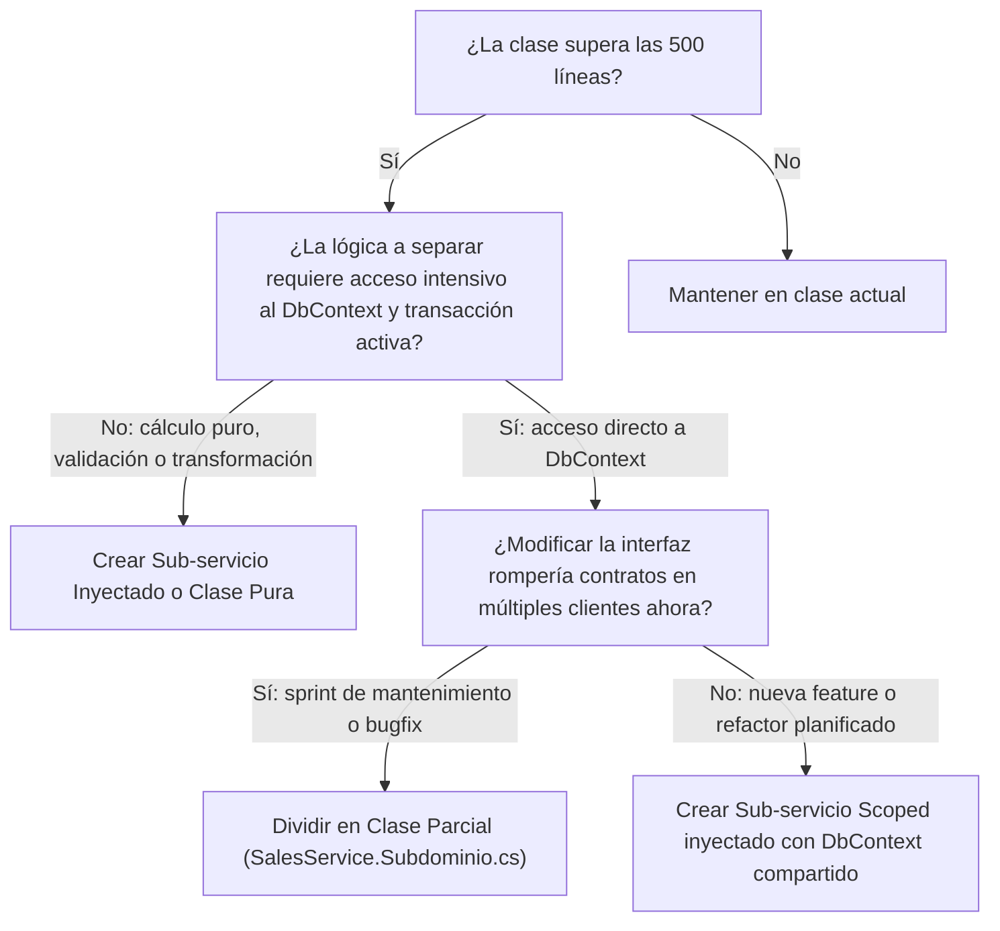

# Manual de Directrices Técnicas y Estándar de Calidad (Coding Guidelines)
## Sistema POS "CommandCenter" — Plataforma de Punto de Venta Distribuida

**Versión:** 1.0.0  
**Fecha de Emisión:** 2026-09-05  
**Estado:** Vigente y de Aplicación Obligatoria  
**Stack Base:** .NET 10 (C# 13), PostgreSQL 16/18, React 19 + Vite 8, WPF (.NET 10)  

---

## 1. Filosofía Arquitectónica y Principios Fundamentales

El sistema POS "CommandCenter" opera bajo un modelo de desarrollo ágil con equipo centralizado/unipersonal, donde **la automatización y la disciplina técnica reemplazan a la burocracia**. Cada línea de código debe diseñarse para ser mantenible, auditable y escalable a largo plazo hacia entornos de múltiples sucursales.

### Los 7 Pilares de Calidad
1. **Mantenibilidad Primero:** Código simple, explícito y desacoplado. Ninguna modificación en un módulo debe provocar efectos colaterales imprevistos en otro. El tamaño objetivo por clase es de **300 a 500 líneas** (ver Sección 1.1 para la política anti-God Objects).
2. **Consistencia Total:** Las mismas convenciones aplican en todo el repositorio. Se prohíbe introducir nueva deuda técnica (como nombres en `_snake_case`, estilos inline desordenados o mezcla de idiomas en mensajes). La deuda histórica se migra de forma gradual y oportunista al intervenir cada archivo.
3. **Seguridad por Defecto (Zero-Trust):** Validación exhaustiva de entradas, autorización estricta basada en roles (RBAC: `Cashier`, `Manager`, `Admin` y `Driver`; bloqueo explícito de `Driver` en ventas, caja y cierres), protección contra ataques comunes (Zip Slip, inyección SQL, bypass de loopback bajo proxy, exposición de credenciales) y aislamiento de secretos.
4. **Rendimiento Consciente:** Cero consultas N+1, uso imperativo de `.AsNoTracking()` en lecturas, `.AsSplitQuery()` en relaciones complejas, paginación en catálogos y virtualización en interfaces gráficas.
5. **Testeabilidad y Regresión Cero:** Cada lógica crítica debe poder probarse de forma aislada. Toda remediación o nueva característica debe acompañarse de pruebas automatizadas que garanticen que la suite completa (≥677 pruebas .NET y ≥73 pruebas Web al cierre de la Rev. 8.4, HEAD `12eddf6`) permanezca en 100% de éxito.
6. **Observabilidad y Resiliencia:** Logs estructurados con parámetros semánticos (evitando concatenación de cadenas), captura centralizada de excepciones y degradación elegante ante fallos de red.
7. **Accesibilidad Operativa:** Interfaces ágiles optimizadas para operación por teclado en caja (hotkeys) y soporte táctil/móvil (`inputMode`).

### 1.1. Directrices Anti-God Objects y Modularización de Clases

Para prevenir la reaparición de "God Objects" (clases monolíticas de más de 1.000 líneas que acumulan múltiples responsabilidades), se establecen las siguientes directrices y límites obligatorios:

#### A. Límites de Tamaño y Responsabilidad Única (SRP)
* **Umbral de Tamaño:** Máximo **300 a 500 líneas** por archivo de clase. Si un archivo supera las 500 líneas, debe programarse su partición o extracción.
* **Principio de Responsabilidad Única (SRP):** Cada clase debe tener una única razón para cambiar.
  * *Ejemplo en Ventas (patrón real implementado con clases parciales):*
    - `SalesService.cs`: Orquestador principal del ciclo de vida de la venta y transacciones.
    - `SalesService.Pricing.cs`: Cálculos matemáticos puros, impuestos, márgenes y redondeos.
    - `SalesService.HoldOrders.cs`: Gestión de órdenes en espera, reservas y abonos parciales.
    - `SalesService.CashAdvance.cs`: Avances de caja y comisiones.
    - `SalesService.History.cs`: Consultas de historial y recuperación de ventas.
    - La estrategia de *sub-servicios Scoped inyectados* (bloque de código de la sección B) queda reservada para extracciones futuras de cálculo puro o flujos independientes.

#### B. Estrategias de División y Árbol de Decisión
1. **Estrategia Táctica (Clases Parciales):**
   * *Mismo tipo, archivos separados:* Divide físicamente el código en archivos cohesivos (`SalesService.Pricing.cs`, `SalesService.HoldOrders.cs`, `InventoryService.StockDeduction.cs`) sin romper la interfaz pública ni los contratos de Inyección de Dependencias.
   * *Cuándo usar:* En refactorizaciones inmediatas donde submódulos comparten intensivamente el mismo contexto transaccional (`_context`, tokens `xmin`) y no se deben alterar contratos públicos.
2. **Estrategia Estratégica (Sub-servicios Inyectados por Composición):**
   * *Desacoplamiento total:* Extraer la lógica a clases independientes registradas como `Scoped` en el contenedor de dependencias:
     ```csharp
     public class SalesService : ISalesService
     {
         private readonly ISalePricingCalculator _pricingCalculator;
         private readonly ISaleHoldCoordinator _holdCoordinator;
         // ...
     }
     ```
   * *Cuándo usar:* Cuando la lógica es de cálculo puro, reglas reutilizables o flujos de negocio independientes. Facilita pruebas unitarias ultrarrápidas sin necesidad de mocks de base de datos.
   * *Regla de Transacciones EF Core:* Los sub-servicios `Scoped` comparten la misma instancia de `SalesDbContext` durante la petición HTTP (Unit of Work compartido). La coordinación con `InventoryDbContext` se mantiene en el orquestador raíz.



#### C. Métricas Objetivas de Complejidad
* **Complejidad Ciclomática (McCabe):** Máximo **10 por método**. Métodos con complejidad > 10 deben refactorizarse extrayendo métodos privados o aplicando patrones (Strategy/State).
* **Número de Métodos Públicos:** Máximo **15 a 20 métodos públicos** por clase o interfaz. Si una clase requiere más métodos, viola el Principio de Segregación de Interfaces (ISP) y debe dividirse.
* **Acoplamiento Inter-módulo:** Cero dependencias circulares. La comunicación entre dominios desacoplados (como Ventas y Logística) debe realizarse exclusivamente mediante eventos en segundo plano (**MediatR**).

#### D. Revisiones de Código y Regla del Boy Scout
* En cada Pull Request se debe verificar que no se agreguen métodos nuevos a clases que ya superen el límite de 500 líneas.
* Si se interviene una clase grande para agregar funcionalidad, es obligatorio planificar la extracción de una clase parcial o sub-servicio en la misma iteración (*"Deja el código más limpio de como lo encontraste"*).

---

## 2. Directrices de Backend (.NET 10 / C#)

### 2.1. Convenciones de Nomenclatura

| Elemento | Regla | Ejemplo Correcto | Ejemplo Prohibido |
|---|---|---|---|
| **Clases, Structs, Records** | `PascalCase` | `SalesService`, `ProductQuickInfoDto` | `salesService`, `product_dto` |
| **Interfaces** | Prefijo `I` + `PascalCase` | `ISalesService`, `IDeliveryService` | `SalesServiceInterface`, `Delivery` |
| **Métodos y Acciones** | `PascalCase` | `GetActiveSessionAsync`, `CalculateTotal` | `getActiveSession`, `get_active_session` |
| **Métodos Asíncronos** | Sufijo `Async` | `RegisterDeliveryOrderAsync` | `RegisterDeliveryOrder` |
| **Parámetros y Variables** | `camelCase` | `cancellationToken`, `orderId`, `exchangeRate` | `CancellationToken`, `order_id` |
| **Campos Privados / Protegidos** | `_` + `camelCase` | `_context`, `_mediator`, `_productService` | `_snake_case`, `m_context`, `context` |
| **Propiedades Públicas** | `PascalCase` | `InvoiceNumber`, `TotalBsS`, `AppliedRate` | `invoice_number`, `totalBss` |
| **Constantes** | `PascalCase` | `SecurityConstants.RoleAdmin` | `ROLE_ADMIN`, `roleAdmin` |
| **Enums y sus Valores** | `PascalCase` singular | `OrderStatus.Pending`, `CashDrawerStatus.Open` | `order_status`, `STATUS_PENDING` |
| **DTOs y Eventos MediatR** | `PascalCase` + sufijo | `DeliveryOrderDto`, `SaleDispatchedEvent` | `DeliveryData`, `saleEvent` |

### 2.2. Idiomática y Estilo de Código
* **File-Scoped Namespaces:** Obligatorio en todos los archivos nuevos.
  ```csharp
  namespace Sales.Module.Services;
  ```
* **Validación de Argumentos en Constructores y Métodos:**
  Usar los métodos modernos `ArgumentNullException.ThrowIfNull` y `ArgumentException.ThrowIfNullOrWhiteSpace`.
  ```csharp
  public DeliveryService(IMediator mediator, ILogger<DeliveryService>? logger = null)
  {
      ArgumentNullException.ThrowIfNull(mediator);
      _mediator = mediator;
      _logger = logger;
  }
  ```
* **Cancelación Cooperativa (`CancellationToken`):**
  Todos los métodos asíncronos en interfaces, servicios y controladores deben aceptar un parámetro `CancellationToken cancellationToken = default` y propagarlo a llamadas de EF Core, HTTP o I/O.
* **Prohibición de `async void`:**
  En servicios, jobs o controladores queda **estrictamente prohibido** el uso de `async void`. Solo se admite `async Task` o `ValueTask`. En manejadores de eventos UI, usar el método de extensión `SafeFireAndForget` con reporte de fallos a `AppLogger.LogCrash`.

### 2.3. Persistencia de Datos con EF Core y PostgreSQL
* **Consultas de Solo Lectura:**
  Toda consulta que no requiera modificar entidades debe incluir explícitamente `.AsNoTracking()`.
  ```csharp
  public async Task<List<CashTransactionDto>> GetHistoryAsync(int limit = 300, CancellationToken ct = default)
  {
      return await _context.CashTransactions
          .AsNoTracking()
          .Include(t => t.Sale)
          .OrderByDescending(t => t.CreatedAt)
          .Take(limit)
          .Select(t => t.ToDto())
          .ToListAsync(ct);
  }
  ```
* **Prevención de Explosión Cartesiana:**
  Consultas que incluyan múltiples colecciones dependientes (ej. `SaleItems` y `Payments`) deben utilizar `.AsSplitQuery()`.
* **Concurrencia Optimista:**
  Entidades de alta concurrencia (`Product`, `CashDrawerSession`, `Sale`) deben mapear tokens de concurrencia mediante la columna oculta `xmin` de PostgreSQL.
* **Transacciones Coordinadas:**
  Al coordinar múltiples contextos (`SalesDbContext` e `InventoryDbContext`), se debe enrolar la transacción ADO.NET subyacente mediante `rawDbTx.UseTransaction()` en lugar de transacciones distribuidas.
* **Prohibición de DDL Manual en `Program.cs`:**
  Las migraciones de EF Core (`MigrateAsync()`) son la única fuente de verdad para el esquema. Comprobaciones defensivas adicionales deben usar consultas no destructivas contra `information_schema.tables` o `information_schema.columns`.

### 2.4. Integridad Financiera y Aritmética Multimoneda
* **Tipos de Datos Monetarios:** Queda estrictamente prohibido el uso de `float` o `double` para representar montos, subtotales, totales, comisiones o tasas de cambio. Se debe usar obligatoriamente `decimal`.
* **Estrategia de Redondeo Fiscal:**
  * Transacciones comerciales y totales de venta: `MidpointRounding.AwayFromZero` a 2 decimales.
  * Tasa oficial de cambio BCV: Redondeo hacia arriba a 4 decimales (`Math.Ceiling(rate * 10000m) / 10000m`).
* **Inmutabilidad del Historial de Ventas (`rules.md`):**
  Bajo ninguna circunstancia se debe recalcular el monto en moneda local de una venta histórica usando la tasa BCV actual. Las ventas cerradas son snapshots inmutables que deben leer estrictamente `AppliedRate`, `TotalUSD`, `TotalBsS` y `FinalPaidAmountBsS`.

### 2.5. Modelo de Excepciones y Respuestas HTTP (RFC 7807)
* **Prohibición de Capturas Genéricas con Fuga de Detalles:**
  Queda prohibido escribir bloques como `catch (Exception ex) { return BadRequest(new { Message = ex.Message }); }`.
* **Centralización en `GlobalExceptionHandlerMiddleware`:**
  Las excepciones deben escalar al middleware global para ser transformadas en objetos estándar `ProblemDetails` (RFC 7807):
  * `KeyNotFoundException` $\rightarrow$ **404 Not Found**
  * `ArgumentException` / `ValidationException` $\rightarrow$ **400 Bad Request**
  * `InvalidOperationException` / `DbUpdateConcurrencyException` $\rightarrow$ **409 Conflict**
  * PostgreSQL `23505` (Violación de clave única) $\rightarrow$ **409 Conflict** con mensaje claro
  * PostgreSQL `23502` (Violación NOT NULL) $\rightarrow$ **400 Bad Request** indicando el campo
  * Excepciones inesperadas $\rightarrow$ **500 Internal Server Error** sanitizado con `traceId` único y registro estructurado en disco mediante `AppLogger.LogCrash`.

---

## 3. Directrices de Frontend Web (React 19 / JSX)

### 3.1. Estructura de Componentes y Nombres
* **Archivos y Módulos:**
  * Componentes visuales y páginas: `PascalCase.jsx` (`QuantityInput.jsx`, `PaymentModal.jsx`, `PosPage.jsx`).
  * Custom Hooks: `camelCase.js` con prefijo `use` (`usePosHotkeys.js`, `useScannerTrap.js`).
  * Clientes API y utilidades: `camelCase.js` (`api.js`, `formatters.js`, `barcodeValidator.js`).
  * Constantes globales de módulo: `UPPER_SNAKE_CASE` (`DEFAULT_TIMEOUT_MS`, `ALLOWED_BARCODE_REGEX`).
* **Orden Interno en Archivos de Componente:**
  1. Imports externos (React, librerías).
  2. Imports internos (componentes UI, contextos, utilidades, estilos).
  3. Constantes del archivo / helpers puros.
  4. Declaración del componente (`export default function NombreComponente({ ... })`).
  5. Hooks de estado y referencias (`useState`, `useRef`, `useContext`).
  6. Efectos y callbacks (`useEffect`, `useCallback`, `useMemo`).
  7. Handlers de eventos (`handleQuantityChange`, `handleSubmit`).
  8. Render JSX.

### 3.2. Contrato Inequívoco de DTOs y Datos
* **Regla de Nombres C# vs JS:**
  * Los DTOs del Backend serializan en formato **`camelCase`** estándar de JSON.
  * En el código React queda **estrictamente prohibido acceder a propiedades en PascalCase** (`item.IsFractional`). Se debe usar siempre `item.isFractional`.
* **Manejo de Errores de API:**
  Todas las peticiones deben realizarse a través del servicio centralizado `api.js`, el cual deserializa de forma jerárquica los objetos `ProblemDetails` (`message`, `detail`, `errors`, `title`).

### 3.3. Estilos y Tokens de Diseño
* **Cero Estilos Inline Arbitrarios:**
  Se prohíbe el uso de estilos inline (`style={{ background: '#fff', color: '#333' }}`) para valores fijos.
* **Design Tokens (Variables CSS):**
  Todos los colores, bordes y superficies deben apoyarse exclusivamente en las variables semánticas definidas en el sistema:
  * Fondos: `var(--bg-surface)`, `var(--bg-card)`, `var(--bg-hover)`, `var(--bg-input)`.
  * Textos: `var(--text-primary)`, `var(--text-secondary)`, `var(--text-muted)`.
  * Bordes: `var(--border)`, `var(--border-focus)`.
  * Estados: `var(--color-primary)`, `var(--color-success)`, `var(--color-danger)`.

---

## 4. Directrices de Cliente Desktop (WPF / MVVM)

### 4.1. Adopción de CommunityToolkit.Mvvm
* **Source Generators:**
  Los ViewModels deben heredar de `ObservableObject` u `ObservableValidator` y utilizar generadores de código de `CommunityToolkit.Mvvm`:
  * `[ObservableProperty]` sobre campos privados en `_camelCase`.
  * `[RelayCommand]` sobre métodos con lógica de comandos.
* **Prohibición de `_snake_case`:**
  Queda formalmente prohibida la declaración de campos en `_snake_case` (ej. `_cash_drawer_service`). Todo campo privado debe seguir la regla `_camelCase` (`_cashDrawerService`).
* **Idioma Unificado:**
  Todos los mensajes de validación y diálogos al usuario final deben estar redactados en español formal.

### 4.2. Ciclo de Vida y Prevención de Fugas de Memoria
* **Implementación de `IDisposable`:**
  Cualquier ViewModel que registre timers (`DispatcherTimer`), tokens de cancelación (`CancellationTokenSource`) o suscripciones a mensajes de `WeakReferenceMessenger` debe implementar `IDisposable`.
* **Cierre de Diálogos y Vistas:**
  En el code-behind de vistas y ventanas (`*.xaml.cs`), se debe interceptar el evento `OnClosed` para invocar explícitamente `(DataContext as IDisposable)?.Dispose()`.
* **Virtualización:**
  Los `DataGrid` y `ListBox` con listas extensas de productos o transacciones deben mantener activa la virtualización por píxel (`VirtualizingStackPanel.IsVirtualizing="True"` y `VirtualizationMode="Recycling"`).

---

## 5. Preparación para Múltiples Sucursales (Multi-Branch Readiness)

> **DECISIÓN DE NEGOCIO (8.25-E3):** El multi-branch es **intención arquitectónica futura**, no requisito actual. El sistema opera hoy como sucursal única (una sola tienda/caja), por lo que **ninguna entidad transaccional implementa `BranchId`** todavía (0 ocurrencias verificadas en 8.22-C6). Esta sección es un **mapa de ruta** para evitar refactorizaciones traumáticas cuando el despliegue multitienda se confirme; las directrices no aplican como gate de cumplimiento hasta entonces.

Con el fin de evitar refactorizaciones traumáticas cuando el sistema se despliegue en múltiples tiendas, se establecen las siguientes directrices estructurales:

1. **Discriminador de Sucursal (`BranchId`):**
   Cuando se habilite el modo multiusuario, toda entidad transaccional (`Sale`, `CashDrawerSession`, `DailyClosure`, `StockMovement`) deberá incluir un campo `BranchId` (por defecto `1` en instalaciones de sucursal única). Hoy el `BranchId` implícito de la instalación es `1`.
2. **Secuencias de Facturación Scoped:**
   La numeración de facturas legales debe admitir prefijos por sucursal y caja (ej. `B01-C01-0001245`), evitando colisiones de claves en operaciones offline que se sincronicen posteriormente.
3. **Desacoplamiento de Stock de Producto:**
   El stock debe concebirse a futuro como una relación de existencias por sucursal (`ProductBranchStock`), aislando la definición del catálogo de las existencias físicas de cada tienda.

---

## 6. Aseguramiento de Calidad y Pipeline CI/CD

### 6.1. Estándar de Pruebas Automatizadas
* **Nomenclatura:** `Metodo_Escenario_ResultadoEsperado`  
  *Ejemplo:* `RegisterDeliveryOrderAsync_WhenOrderIdZero_ThrowsArgumentException`
* **Cobertura Mínima:** $\ge 70\%$ en capas críticas de dominio (`Sales.Module`, `Inventory.Module`, `Core`). Medición de **código de dominio**: el gate de CI (`scripts/check-coverage.py`) excluye el scaffolding generado por `dotnet-ef` (`*.Migrations.*`), que se verifica por ejecución real vía el smoke `MigratedSchema`/`MigrateAsync` (decisión 8.26-E4). Línea base 8.26-E4: `Core ≥ 0.70`, `Sales.Module ≥ 0.80`, `Inventory.Module ≥ 0.72`.
* **Pruebas de Integración:**
  * En **CI (GitHub Actions):** Se ejecutan sobre el contenedor nativo de servicio `postgres:16` mediante la variable `TEST_POSTGRES_CONNECTION`.
  * En **Local:** Se admite el servicio local de PostgreSQL o contenedores con *Testcontainers*.

### 6.2. Pipeline de Integración Continua (`ci.yml`)
El flujo automatizado en GitHub Actions valida en cada Pull Request y Push a `main`/`develop`:
1. **Frontend:** Ejecución de `npm run lint` (`oxlint`) y `npm test` en `Web.Frontend`.
2. **Backend:** Compilación estricta con `TreatWarningsAsErrors=true` en Release.
3. **Suite Completa:** Ejecución de las 729 pruebas .NET (`dotnet test`) y 77 pruebas Web (`node --test`) con recolección de cobertura Cobertura XML.

---

## 7. Métricas de Aceptación (Definition of Done)

Para que cualquier Pull Request o cambio sea considerado completado y apto para merge:
- [ ] 0 Errores y 0 Advertencias de compilación en .NET (`dotnet build -c Release`).
- [ ] 0 Errores de linting en Frontend (`npm run lint`).
- [ ] 100% de pruebas superadas en .NET (`dotnet test`) y Web (`npm test`).
- [ ] Cobertura de pruebas mantenida o incrementada sobre lógica nueva.
- [ ] Sin dependencias vulnerables conocidas (`dotnet list package --vulnerable`, `npm audit`).
- [ ] Documentación sincronizada en `ARCHITECTURE.md` y reportes de módulo si se alteran contratos o arquitectura.
