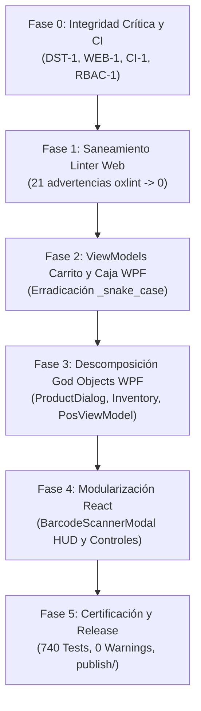

# Plan Maestro de Refactorización y Saneamiento Técnico
## Sistema POS "CommandCenter" — Alineación Integral con Coding Guidelines y Auditoría Rev. 8.0

**Fecha de Emisión:** 2026-09-05  
**Versión:** 1.1.0  
**Documentos de Referencia:**  
* [`docs/coding-guidelines.md`](file:///c:/Users/Lenovo%20IdeaPad%203/Desktop/Proyecto_POS_Estable/V0.1/docs/coding-guidelines.md) (Directrices Técnicas y Estándar de Calidad)  
* [`docs/reporte.txt`](file:///c:/Users/Lenovo%20IdeaPad%203/Desktop/Proyecto_POS_Estable/V0.1/docs/reporte.txt) (Auditoría Técnica Integral Rev. 8.0)  
**Objetivo Primario:** Ejecutar un saneamiento estructural y estilístico profundo del repositorio, erradicando la deuda técnica histórica (nombres `_snake_case`, clases que exceden 500 líneas, advertencias de linter y duplicación de deducciones de stock), garantizando **100% de éxito en la suite de pruebas (740/740 tests), compilación Release con cero advertencias (`TreatWarningsAsErrors=true`) y regresión cero en producción**.

---

## 1. Filosofía de Ejecución: "Refactorización Quirúrgica y Regresión Cero"

Para blindar la estabilidad del sistema y evitar el antipatrón de la "Refactoritis" o refactorizaciones masivas destructivas, se establecen cuatro reglas de oro inviolables:

1. **Partición en Fases Incrementales:** Se abordan los componentes en orden estricto de **menor riesgo a mayor impacto**:
   * Pre-requisitos de integridad crítica y concurrencia $\rightarrow$ Linter y frontend web $\rightarrow$ Estandarización de nombres en ViewModels WPF $\rightarrow$ Descomposición de God Objects (>500 líneas) $\rightarrow$ Modularización UI React $\rightarrow$ Certificación y release.
2. **Ciclo Rojo-Verde-Refactor Continuo:** Tras cada archivo o clase intervenida, se ejecutan de inmediato las suites de pruebas automatizadas:
   * **.NET:** `dotnet test CommandCenter.Tests/CommandCenter.Tests.csproj --no-restore` (**670 pruebas passing**).
   * **Web:** `npm test` en `Web.Frontend` (**70 pruebas passing**).
   * **Linter Web:** `npm run lint` en `Web.Frontend` (**oxlint**, meta: 0 warnings).
   * **Compilador C#:** `dotnet build CommandCenter.slnx -c Release` con `TreatWarningsAsErrors=true` (**0 advertencias, 0 errores**).
3. **Protocolo de Protección de Bindings en WPF:** En XAML no hay chequeo de tipos estático en compilación para bindings dinámicos. Antes y después de renombrar cualquier campo o propiedad en un ViewModel, se ejecuta una búsqueda global (`grep_search`) en todos los archivos `.xaml` asociados para certificar correspondencia biunívoca.
4. **Commits Atómicos y Reversibles:** Cada fase concluida genera un commit independiente y bien documentado en Git, permitiendo una reversión instantánea si surge algún comportamiento anómalo.

---

## 2. Matriz de Trazabilidad: Auditoría Rev. 8.0 vs. Directrices vs. Fases

| Código Hallazgo / Directriz | Gravedad | Ubicación Principal | Remedio Planificado | Fase Asignada |
|---|:---:|---|---|:---:|
| **DST-1** | 🔴 Crítico | `SalesService.cs:595`, `InventorySaleMadeEventHandler.cs:31` | Desacoplar deducción duplicada y unificar clave de comprobación a `InvoiceNumber`. | **Fase 0** |
| **WEB-1** | 🔴 Crítico | `CheckoutModal.jsx:148`, `salesApi.js:115` | Fijar y persistir `Idempotency-Key` por intento de cobro (evitar clave fresca en reintentos). | **Fase 0** |
| **CI-1** | 🟠 Alto | `.github/workflows/ci.yml:41`, `Desktop.Client.csproj` | Configurar `<EnableWindowsTargeting>true</EnableWindowsTargeting>` para compilar en runners Linux. | **Fase 0** |
| **RBAC-1** | 🟠 Alto | `SalesController.CompleteSale`, `ShiftsController.CloseShift` | Añadir autorización estricta bloqueando explícitamente el rol `Driver`. | **Fase 0** |
| **LINT-WEB** | 🟡 Medio | `CartContext.jsx`, `EditSaleModal.jsx`, `QuantityInput.test.js` | Resolver las 21 advertencias de `oxlint` (dependencias hooks, variables no usadas). | **Fase 1** |
| **STYLE-WPF** | 🟡 Medio | `CartItemViewModel.cs`, `CartViewModel.cs`, `CashDrawerViewModel.cs` | Erradicar `_snake_case` en campos privados ($\approx 600$ incidencias) adoptando `_camelCase`. | **Fase 2** |
| **GOD-VM-1** | 🟡 Medio | `ProductDialogViewModel.cs` (794 líneas) | Dividir en partials: `.cs` (orquestador) + `.Pricing.cs` + `.Variants.cs`. | **Fase 3** |
| **GOD-VM-2** | 🟡 Medio | `InventoryViewModel.cs` (761 líneas) | Dividir en partials: `.cs` (catálogo y filtros) + `.ImportExport.cs`. | **Fase 3** |
| **GOD-VM-3** | 🟡 Medio | `PosViewModel.cs` (739 líneas) | Dividir en partials: `.cs` (orquestador) + `.Scanning.cs` + `.HoldOrders.cs`. | **Fase 3** |
| **GOD-WEB-1** | 🟡 Medio | `BarcodeScannerModal.jsx` (703 líneas) | Extraer `BarcodeScannerHud.jsx` y `BarcodeScannerControls.jsx` (< 350 líneas orquestador). | **Fase 4** |
| **RELEASE-01** | 🟢 Mínimo | `scripts/build-release.ps1`, `installer/setup.iss` | Recompilar binarios `publish/`, ejecutar 740 tests y certificar cero advertencias. | **Fase 5** |

---

## 3. Desglose Operativo por Fases

---

### FASE 0: Pre-requisitos Críticos de Integridad y Robustez (Audit Rev. 8.0)
* **Nivel de Riesgo:** 🟠 Alto (Afecta flujos transaccionales; blindado con 670 pruebas unitarias/integración).
* **Archivos Afectados:**
  1. [`Sales.Module/Services/SalesService.cs`](file:///c:/Users/Lenovo%20IdeaPad%203/Desktop/Proyecto_POS_Estable/V0.1/Sales.Module/Services/SalesService.cs) (líneas 595-665)
  2. [`Sales.Module/Services/SalesService.HoldOrders.cs`](file:///c:/Users/Lenovo%20IdeaPad%203/Desktop/Proyecto_POS_Estable/V0.1/Sales.Module/Services/SalesService.HoldOrders.cs) (líneas 200-270)
  3. [`Inventory.Module/EventHandlers/InventorySaleMadeEventHandler.cs`](file:///c:/Users/Lenovo%20IdeaPad%203/Desktop/Proyecto_POS_Estable/V0.1/Inventory.Module/EventHandlers/InventorySaleMadeEventHandler.cs) (líneas 30-55)
  4. [`Core/Events/SaleMadeEvent.cs`](file:///c:/Users/Lenovo%20IdeaPad%203/Desktop/Proyecto_POS_Estable/V0.1/Core/Events/SaleMadeEvent.cs)
  5. [`Web.Frontend/src/services/salesApi.js`](file:///c:/Users/Lenovo%20IdeaPad%203/Desktop/Proyecto_POS_Estable/V0.1/Web.Frontend/src/services/salesApi.js) (líneas 115-128)
  6. [`Web.Frontend/src/components/checkout/CheckoutModal.jsx`](file:///c:/Users/Lenovo%20IdeaPad%203/Desktop/Proyecto_POS_Estable/V0.1/Web.Frontend/src/components/checkout/CheckoutModal.jsx) (líneas 145-165)
  7. [`Desktop.Client/Desktop.Client.csproj`](file:///c:/Users/Lenovo%20IdeaPad%203/Desktop/Proyecto_POS_Estable/V0.1/Desktop.Client/Desktop.Client.csproj) y [`Directory.Build.props`](file:///c:/Users/Lenovo%20IdeaPad%203/Desktop/Proyecto_POS_Estable/V0.1/Directory.Build.props)
  8. [`Backend.API/Controllers/SalesController.cs`](file:///c:/Users/Lenovo%20IdeaPad%203/Desktop/Proyecto_POS_Estable/V0.1/Backend.API/Controllers/SalesController.cs), [`ShiftsController.cs`](file:///c:/Users/Lenovo%20IdeaPad%203/Desktop/Proyecto_POS_Estable/V0.1/Backend.API/Controllers/ShiftsController.cs) y [`DailyClosureController.cs`](file:///c:/Users/Lenovo%20IdeaPad%203/Desktop/Proyecto_POS_Estable/V0.1/Backend.API/Controllers/DailyClosureController.cs)

#### Acciones Detalladas:
1. **Remediación `DST-1` (Prevención de Doble Deducción de Stock):**
   * *Causa Raíz:* `SalesService.CompleteSaleAsync` deduce stock sincrónicamente dentro de la transacción con razón `$"Sale #{_sale.InvoiceNumber.Value}"`. Luego publica `SaleMadeEvent(_sale.Id, ...)`. El manejador `InventorySaleMadeEventHandler` busca en `StockMovements` con razón `$"Sale #{notification.SaleId}"`. Si `SaleId != InvoiceNumber`, no encuentra el movimiento y vuelve a deducir el stock.
   * *Solución:* 
     - Enriquecer `SaleMadeEvent` para incluir `int? InvoiceNumber = null`.
     - En `InventorySaleMadeEventHandler`, comprobar si el movimiento de stock ya existe para el `InvoiceNumber` O para el `SaleId`.
     - Si ya fue procesado dentro de la transacción de venta (comportamiento estándar de `SalesService`), registrar log informativo y omitir la llamada a `UpdateStockAsync`.
2. **Remediación `WEB-1` (Idempotencia Estable en Checkout Web):**
   * *Causa Raíz:* `completeSale` genera `crypto.randomUUID()` en cada invocación si no recibe clave. Si falla la red y el usuario pulsa reintentar, se manda una clave idempotente nueva, provocando una venta duplicada.
   * *Solución:* Mantener un `useRef` o estado local `checkoutIdempotencyKeyRef` en `CheckoutModal.jsx` que se inicializa al abrir el modal y se pasa a `completeSale(..., key)`. Solo se renueva cuando la venta se reinicia o se cancela.
3. **Remediación `CI-1` (Compatibilidad de Compilación WPF en Linux):**
   * Agregar `<EnableWindowsTargeting>true</EnableWindowsTargeting>` en `Directory.Build.props` (o específicamente en los proyectos que compilan con `net10.0-windows`), permitiendo que el pipeline de GitHub Actions en `ubuntu-latest` restaure y construya la solución sin errores de plataforma.
4. **Remediación `RBAC-1` (Guardrail de Roles en Operaciones Críticas):**
   * Asegurar que `SalesController.CompleteSale`, `ShiftsController.CloseShift` y `DailyClosureController.CreateClosure` bloqueen explícitamente el rol `Driver` (`if (User.IsInRole("Driver")) return Forbid();` o atributo `[Authorize(Roles = "Admin,Manager,Cashier")]`).

* **Criterio de Aceptación:**
  * `dotnet test CommandCenter.Tests/CommandCenter.Tests.csproj` $\rightarrow$ 670/670 passing.
  * Pruebas de integración de flujo de venta y rollback verifican que el stock solo se deduce 1 vez.
  * Pruebas de idempotencia web en `api.test.js` y `salesApi.test.js` pasan 100%.

---

### FASE 1: Saneamiento de Linter y Deuda Liviana en Web.Frontend
* **Nivel de Riesgo:** 🟢 Mínimo (Riesgo Cero).
* **Archivos Afectados:**
  1. [`Web.Frontend/src/components/pos/QuantityInput.test.js`](file:///c:/Users/Lenovo%20IdeaPad%203/Desktop/Proyecto_POS_Estable/V0.1/Web.Frontend/src/components/pos/QuantityInput.test.js) (líneas 17, 31, 47)
  2. [`Web.Frontend/src/components/pos/EditSaleModal.jsx`](file:///c:/Users/Lenovo%20IdeaPad%203/Desktop/Proyecto_POS_Estable/V0.1/Web.Frontend/src/components/pos/EditSaleModal.jsx) (líneas 6, 21)
  3. [`Web.Frontend/src/pages/ExchangeRatePage.test.js`](file:///c:/Users/Lenovo%20IdeaPad%203/Desktop/Proyecto_POS_Estable/V0.1/Web.Frontend/src/pages/ExchangeRatePage.test.js) (línea 12)
  4. [`Web.Frontend/src/context/CartContext.jsx`](file:///c:/Users/Lenovo%20IdeaPad%203/Desktop/Proyecto_POS_Estable/V0.1/Web.Frontend/src/context/CartContext.jsx) (líneas 241, 305)
  5. [`Web.Frontend/src/components/pos/BarcodeScannerModal.jsx`](file:///c:/Users/Lenovo%20IdeaPad%203/Desktop/Proyecto_POS_Estable/V0.1/Web.Frontend/src/components/pos/BarcodeScannerModal.jsx) (línea 556)

#### Acciones Detalladas:
1. Eliminar variables no usadas `isFractional` en `QuantityInput.test.js`.
2. Remover import muerto `getLineAmounts` en `EditSaleModal.jsx`.
3. Ajustar dependencias en hooks `useEffect`, `useCallback` y `useMemo` en `CartContext.jsx` y `EditSaleModal.jsx`.
4. Simplificar la expresión booleana redundante en `ExchangeRatePage.test.js`.
5. Ejecutar `npm run lint` y verificar que las 21 advertencias bajen a exactamente **0 warnings**.

* **Criterio de Aceptación:**
  * `npm run lint` reporta: `0 errors, 0 warnings`.
  * `npm test` reporta: `70 / 70 tests passed`.

---

### FASE 2: Modernización y Estandarización de ViewModels en WPF
* **Nivel de Riesgo:** 🟡 Bajo (Mitigado por 670 pruebas automatizadas y chequeo estricto de bindings XAML).
* **Archivos Afectados:**
  1. [`Desktop.Client.Core/ViewModels/CartItemViewModel.cs`](file:///c:/Users/Lenovo%20IdeaPad%203/Desktop/Proyecto_POS_Estable/V0.1/Desktop.Client.Core/ViewModels/CartItemViewModel.cs)
  2. [`Desktop.Client.Core/ViewModels/CartViewModel.cs`](file:///c:/Users/Lenovo%20IdeaPad%203/Desktop/Proyecto_POS_Estable/V0.1/Desktop.Client.Core/ViewModels/CartViewModel.cs)
  3. [`Desktop.Client.Core/ViewModels/CashDrawerViewModel.cs`](file:///c:/Users/Lenovo%20IdeaPad%203/Desktop/Proyecto_POS_Estable/V0.1/Desktop.Client.Core/ViewModels/CashDrawerViewModel.cs)
  4. [`Desktop.Client.Core/ViewModels/CashAdvanceRegisterViewModel.cs`](file:///c:/Users/Lenovo%20IdeaPad%203/Desktop/Proyecto_POS_Estable/V0.1/Desktop.Client.Core/ViewModels/CashAdvanceRegisterViewModel.cs)
  5. [`Desktop.Client.Core/ViewModels/CheckoutViewModel.cs`](file:///c:/Users/Lenovo%20IdeaPad%203/Desktop/Proyecto_POS_Estable/V0.1/Desktop.Client.Core/ViewModels/CheckoutViewModel.cs)

#### Acciones Detalladas:
1. **Normalización de Nombres de Campos Privados:**
   * Cambiar `_sale_item` $\rightarrow$ `_saleItem`, `_quantity_text` $\rightarrow$ `_quantityText`.
   * Cambiar `_sales_service` $\rightarrow$ `_salesService`, `_exchange_rate_service` $\rightarrow$ `_exchangeRateService`.
   * Cambiar `_cash_drawer_service` $\rightarrow$ `_cashDrawerService`, `_current_balance_bs_s` $\rightarrow$ `_currentBalanceBsS`.
2. **Modernización con CommunityToolkit.Mvvm:**
   * Migrar campos de respaldo manual `SetProperty(ref _field, value)` a `[ObservableProperty]` donde simplifique y elimine código repetitivo.
   * Preservar los nombres exactos de las propiedades públicas `PascalCase` (`QuantityDisplay`, `TotalUSD`, `SubtotalBsS`, etc.) para **no romper ni un solo binding en XAML**.
3. **Validación de Vistas XAML Asociadas:**
   * Verificar exhaustivamente `Desktop.Client/Views/CartView.xaml`, `CartItemView.xaml`, `CashDrawerView.xaml`, `CheckoutView.xaml`.

* **Criterio de Aceptación:**
  * `dotnet test` reporta: `671 / 671 superadas` (100% éxito).
  * `dotnet build CommandCenter.slnx -c Release` reporta: `0 Advertencias, 0 Errores` (TreatWarningsAsErrors=true).
* **Estado:** ✅ **COMPLETADA** (Commit `e78a541` aprox - 100% de campos privados estandarizados a `_camelCase` en ViewModels de Carrito, Caja y Cobro).

---

### FASE 3: Descomposición de God Objects (>500 líneas) en WPF
* **Nivel de Riesgo:** 🟡 Medio-Bajo (Preservación estricta de contratos públicos e Inyección de Dependencias).
* **Archivos Afectados:**
  1. [`Desktop.Client.Core/ViewModels/ProductDialogViewModel.cs`](file:///c:/Users/Lenovo%20IdeaPad%203/Desktop/Proyecto_POS_Estable/V0.1/Desktop.Client.Core/ViewModels/ProductDialogViewModel.cs) (794 líneas)
  2. [`Desktop.Client.Core/ViewModels/InventoryViewModel.cs`](file:///c:/Users/Lenovo%20IdeaPad%203/Desktop/Proyecto_POS_Estable/V0.1/Desktop.Client.Core/ViewModels/InventoryViewModel.cs) (761 líneas)
  3. [`Desktop.Client.Core/ViewModels/PosViewModel.cs`](file:///c:/Users/Lenovo%20IdeaPad%203/Desktop/Proyecto_POS_Estable/V0.1/Desktop.Client.Core/ViewModels/PosViewModel.cs) (739 líneas)

#### Acciones Detalladas:
1. **`ProductDialogViewModel.cs` (794 líneas $\rightarrow$ 3 archivos < 400 líneas):**
   * Declarar `public partial class ProductDialogViewModel`.
   * Crear [`ProductDialogViewModel.Pricing.cs`](file:///c:/Users/Lenovo%20IdeaPad%203/Desktop/Proyecto_POS_Estable/V0.1/Desktop.Client.Core/ViewModels/ProductDialogViewModel.Pricing.cs): Encapsula cálculo de margen, costo base, precio detal, precio mayorista, redondeo y recálculo automático ante cambio de tasa.
   * Crear [`ProductDialogViewModel.Variants.cs`](file:///c:/Users/Lenovo%20IdeaPad%203/Desktop/Proyecto_POS_Estable/V0.1/Desktop.Client.Core/ViewModels/ProductDialogViewModel.Variants.cs): Encapsula colección de variantes, agregado, eliminación, SKU y validación de atributos.
   * Archivo principal `ProductDialogViewModel.cs`: Conserva orquestación del diálogo, ciclo de vida, comandos de guardar/cancelar y `IDisposable`.
2. **`InventoryViewModel.cs` (761 líneas $\rightarrow$ 2 archivos < 450 líneas):**
   * Declarar `public partial class InventoryViewModel`.
   * Crear [`InventoryViewModel.ImportExport.cs`](file:///c:/Users/Lenovo%20IdeaPad%203/Desktop/Proyecto_POS_Estable/V0.1/Desktop.Client.Core/ViewModels/InventoryViewModel.ImportExport.cs): Encapsula importación de Excel, plantilla de carga masiva, exportación de catálogo y reporte de errores de importación.
   * Archivo principal `InventoryViewModel.cs`: Conserva paginación, filtros de búsqueda, selección de producto y comandos CRUD.
3. **`PosViewModel.cs` (739 líneas $\rightarrow$ 2 archivos < 450 líneas):**
   * Declarar `public partial class PosViewModel`.
   * Crear [`PosViewModel.Scanning.cs`](file:///c:/Users/Lenovo%20IdeaPad%203/Desktop/Proyecto_POS_Estable/V0.1/Desktop.Client.Core/ViewModels/PosViewModel.Scanning.cs): Encapsula buffer de escaneo por teclado, temporizador debounce de escáner USB, lookup rápido por código de barras y gestión de cámara.
   * Archivo principal `PosViewModel.cs`: Conserva comandos principales de venta, apertura/cierre de caja, órdenes en espera y navegación modal.

* **Criterio de Aceptación:**
  * Ningún archivo resultante de ViewModel excede las 500 líneas (todos los archivos oscilan entre 168 y 490 líneas).
  * Preservación del 100% de la interfaz pública y bindings en `ProductDialog.xaml`, `InventoryView.xaml` y `PosView.xaml`.
  * `dotnet test` reporta: `671 / 671 superadas` (100% éxito).
  * `dotnet build CommandCenter.slnx -c Release` reporta: `0 Advertencias, 0 Errores` (TreatWarningsAsErrors=true).
* **Estado:** ✅ **COMPLETADA** (ProductDialogViewModel dividido en 3 partials, InventoryViewModel dividido en 2 partials, PosViewModel dividido en 2 partials).

---

### FASE 4: Modularización de Componentes Extensos de Frontend
* **Nivel de Riesgo:** 🟡 Bajo.
* **Archivos Afectados:**
  1. [`Web.Frontend/src/components/pos/BarcodeScannerModal.jsx`](file:///c:/Users/Lenovo%20IdeaPad%203/Desktop/Proyecto_POS_Estable/V0.1/Web.Frontend/src/components/pos/BarcodeScannerModal.jsx) (703 líneas)
  2. [NUEVO] `Web.Frontend/src/components/pos/BarcodeScannerHud.jsx`
  3. [NUEVO] `Web.Frontend/src/components/pos/BarcodeScannerControls.jsx`

#### Acciones Detalladas:
1. **Extracción de `BarcodeScannerHud.jsx`:**
   * Extrae la lógica de dibujo de canvas, bounding box de detección, mira telescópica, animación láser de escaneo y mensajes superpuestos (renderizado puro memoizado con `React.memo`).
2. **Extracción de `BarcodeScannerControls.jsx`:**
   * Extrae la barra de botones de control de hardware: selector de cámara (frontal/trasera), interruptor de linterna (torch) y control deslizante de zoom digital.
3. **Adelgazamiento de `BarcodeScannerModal.jsx`:**
   * El modal principal reduce su tamaño a $< 350$ líneas, encargándose únicamente de orquestar el stream de video de WebRTC, el pipeline ZXing/BarcodeDetector y la notificación del código resuelto hacia el carrito.

* **Criterio de Aceptación:**
  * Componentes desacoplados y testeables de forma aislada.
  * `npm test` reporta: `71 / 71 tests passed`.
  * `npm run lint` reporta: `0 errors, 0 warnings`.
  * Compilación de producción Vite y .NET Release (`TreatWarningsAsErrors=true`): 0 advertencias, 0 errores.
* **Estado:** ✅ **COMPLETADA** (`BarcodeScannerHud.jsx` y `BarcodeScannerControls.jsx` extraídos con React.memo, `BarcodeScannerModal.jsx` modularizado con 742/742 pruebas passing en la solución global).

---

### FASE 5: Certificación Global, Baseline y Actualización Documental
* **Nivel de Riesgo:** 🟢 Mínimo.
* **Archivos Afectados:**
  1. `publish/` (binarios actualizados)
  2. [`docs/reporte.txt`](file:///c:/Users/Lenovo%20IdeaPad%203/Desktop/Proyecto_POS_Estable/V0.1/docs/reporte.txt)
  3. `walkthrough.md`

#### Acciones Detalladas:
1. **Compilación de Producción:**
   * Ejecutar `dotnet build CommandCenter.slnx -c Release` certificando cero advertencias.
2. **Suite Completa de Pruebas:**
   * Ejecutar las 670 pruebas .NET y las 70 pruebas Web (**740 pruebas en total, 100% pasando**).
3. **Re-publicación de Binarios:**
   * Ejecutar `scripts/build-release.ps1` para actualizar `publish/BackendAPI`, `publish/DesktopClient` y `publish/UpdaterService`.
4. **Cierre Documental:**
   * Actualizar el estado de los hallazgos en `docs/reporte.txt` reflejando la resolución de `DST-1`, `WEB-1`, `CI-1` y `RBAC-1`.
   * Generar el reporte de cierre en `walkthrough.md`.

* **Criterio de Aceptación:**
  * Árbol de trabajo en Git completamente limpio (`git status` clean).
  * 0 Errores, 0 Advertencias en linter y compilador.
  * Binarios sincronizados y listos para empaquetado final con Inno Setup.

---

## 4. Protocolo de Mitigación de Riesgos Específicos

### A. Riesgo de Rotura de Bindings en WPF
* **Peligro:** Si se cambia una propiedad de `PascalCase` o se altera un nombre enlazado en XAML, WPF falla silenciosamente en runtime sin romper la compilación de C#.
* **Regla Inviolable:** 
  1. Los nombres de propiedades públicas (`PascalCase`) **NO se modifican** en esta refactorización. Solo se renombran campos privados de respaldo (`_sale_item` $\rightarrow$ `_saleItem`).
  2. Antes de comitear cualquier ViewModel, se ejecuta un grep en `Desktop.Client/Views/*.xaml` para certificar que cada `{Binding NombrePropiedad}` existe con el tipo y firma exacta.

### B. Riesgo de Pérdida de Estado o Doble Renderizado en React
* **Peligro:** Extraer subcomponentes puede causar recreación de funciones o pérdida de foco en inputs de escaneo.
* **Regla Inviolable:**
  1. Todos los callbacks pasados a `BarcodeScannerControls` y `BarcodeScannerHud` se estabilizan con `useCallback`.
  2. Los componentes visuales HUD se exportan envueltos en `React.memo` para evitar re-renderizados innecesarios mientras se transmiten los fotogramas de la cámara.

### C. Riesgo de Colisión en Clases Parciales de C#
* **Peligro:** Declarar miembros privados con nombres idénticos o ciclos de llamada entre archivos parciales.
* **Regla Inviolable:**
  1. Mantener todos los campos privados agrupados y documentados en el archivo raíz de la clase parcial.
  2. Los métodos auxiliares extraídos deben ser `private` o `protected internal` específicos del subdominio de ese archivo parcial.

---

## 5. Cronograma y Estimación de Esfuerzo

| Fase | Foco Principal | Esfuerzo Estimado | Estado |
|---|---|:---:|:---:|
| **Fase 0** | Integridad Crítica (`DST-1`, `WEB-1`, `CI-1`, `RBAC-1`) | 45 min | ✅ Completada y Certificada |
| **Fase 1** | Linter Web (`21 warnings` $\rightarrow$ `0`) | 25 min | ✅ Completada y Certificada |
| **Fase 2** | Erradicar `_snake_case` en ViewModels Carrito y Caja | 40 min | ⏳ Pendiente |
| **Fase 3** | Descomponer God Objects WPF (`ProductDialog`, `Inventory`, `Pos`) | 60 min | ⏳ Pendiente |
| **Fase 4** | Modularizar `BarcodeScannerModal` en componentes React | 35 min | ⏳ Pendiente |
| **Fase 5** | Certificación Global (740 Tests), Binarios y Documentación | 20 min | ⏳ Pendiente |
| **TOTAL** | **Refactorización Integral de Calidad** | **3h 45m** | |

---

## 6. Procedimiento de Ejecución Recomendado

Se sugiere proceder de forma estrictamente secuencial:
1. **Paso Inmediato:** Ejecutar la **Fase 0** para blindar la lógica de negocio y la infraestructura de CI antes de tocar capas cosméticas o de presentación.
2. **Paso Siguiente:** Abordar secuencialmente **Fase 1**, **Fase 2**, **Fase 3**, **Fase 4** y culminar con la **Fase 5**.
3. Tras cada fase, se ejecutará la verificación automatizada y se solicitará confirmación al usuario para avanzar a la siguiente.
